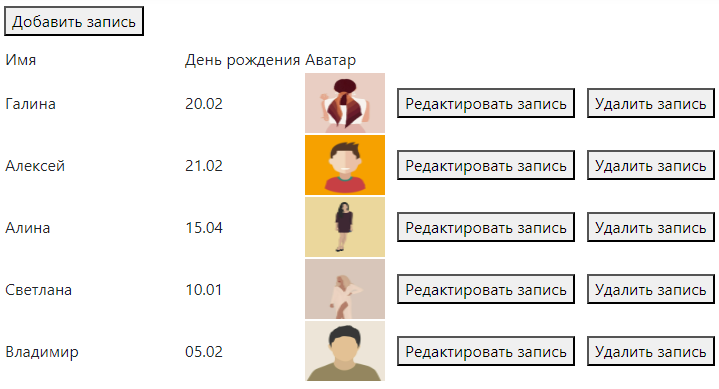
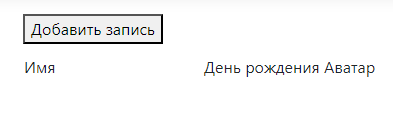
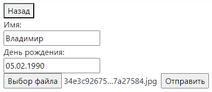
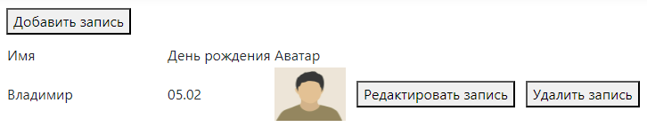
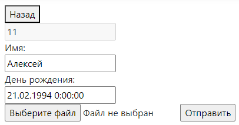
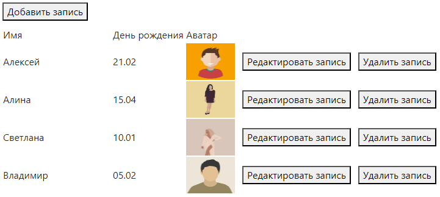

# BirthdaysCalendarProject

## Запуск
Необходимо запустить PostgreSQL, указать в appsettings.json данные подключения к БД.

## Описание функционала
Список записей о днях рождений записывается в порядке возрастания от сегодняшней даты. Например, сегодня 11.02.2024:
\
10.01 и 05.02 в 2024 году уже прошли, поэтому отображается после дат, которые в текущем году ещё не наступили.

## Иллюстрации действий
* Пустой список:\

* Страница добавления записи:\

* Список после добавления:\

* Редактирование:\

* Удаление:\

